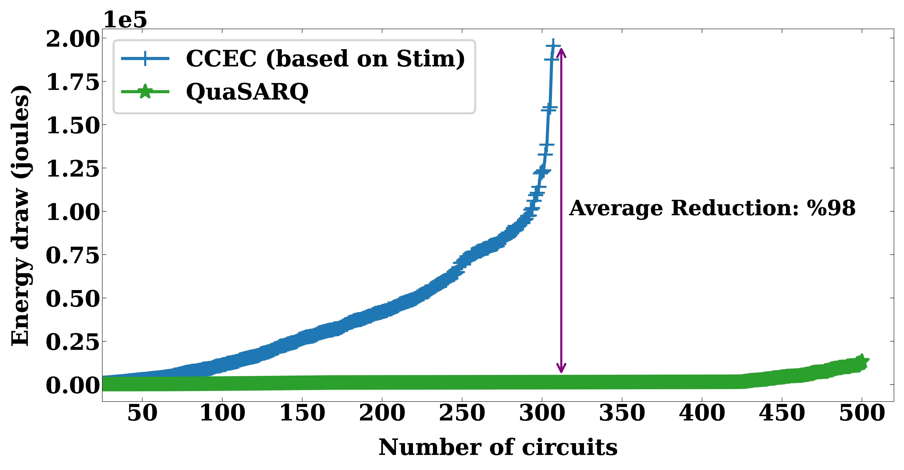
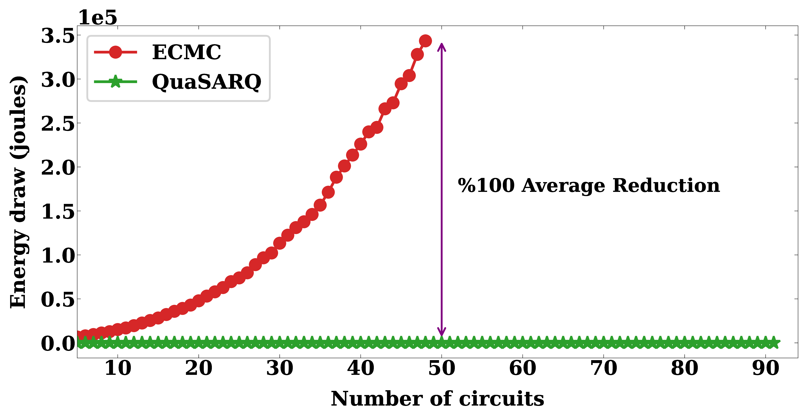

[](https://www.gnu.org/licenses/gpl-3.0)
[](https://github.com/muhos/QuaSARQ/actions/workflows/test-build.yml)


[](https://arxiv.org/abs/2603.14641)
[](https://doi.org/10.1007/978-3-031-90660-2_6)

# QuaSARQ

QuaSARQ stands for Quantum Simulation and Automated Reasoning. It is a CUDA-accelerated toolkit for large stabilizer circuits, with support for single-shot simulation, many-shot sampling, and equivalence checking.

QuaSARQ is designed for circuits where CPU stabilizer simulators become bottlenecked by tableau updates, measurement handling, or repeated sampling. It runs the core stabilizer operations on NVIDIA GPUs and includes a deterministic equivalence checker for stabilizer circuits.

## Highlights

- GPU-accelerated stabilizer tableau simulation.
- Many-shot sampling using GPU-based Pauli frames.
- Equivalence checking for stabilizer circuits.
- Support for Stim (`.stim`) and OpenQASM (`.qasm`) inputs.
- Random Clifford circuit generation for benchmarking.
- Built-in diagnostics for scheduler, tableau, measurement records, detectors, and observables.

## Requirements

- NVIDIA GPU with a recent driver.
- CUDA Toolkit 12 or later.
- GCC/G++ with C++20 support.
- CMake 3.18 or later, used to build cuArena.
- [cuArena](https://github.com/muhos/cuArena), the GPU memory allocator used by QuaSARQ.

## Build

Install CUDA using the official NVIDIA instructions for your platform. On Ubuntu 24.04, one possible setup is:

```bash
wget https://developer.download.nvidia.com/compute/cuda/repos/ubuntu2404/x86_64/cuda-keyring_1.1-1_all.deb
sudo dpkg -i cuda-keyring_1.1-1_all.deb
sudo apt-get update
sudo apt-get -y install cuda-toolkit-12-9
```

Clone cuArena, then build QuaSARQ:

```bash
git clone https://github.com/muhos/cuArena.git /path/to/cuArena
make CUARENA_DIR=/path/to/cuArena
```

The build creates:

- `build/quasarq`: the command-line executable.
- `build/libquasarq.a`: the static library.

Useful build variants:

```bash
make CUARENA_DIR=/path/to/cuArena assert=1
make CUARENA_DIR=/path/to/cuArena debug=1
make CUARENA_DIR=/path/to/cuArena word=32
make CUARENA_DIR=/path/to/cuArena nocolor=1
```

Run the test suite with:

```bash
make test
```

## Quick Start

Run a circuit:

```bash
./build/quasarq examples/deterministic_measurement.stim
```

Sample measurements:

```bash
./build/quasarq examples/deterministic_measurement.stim --shots=1024 --seed=1
```

Check two equivalent circuits:

```bash
./build/quasarq examples/equiv_a.stim examples/equiv_b.stim
```

Expected result:

```text
Circuits check                 : EQUIVALENT
```

Check two different circuits:

```bash
./build/quasarq examples/equiv_a.stim examples/not_equiv.stim
```

Expected result:

```text
Circuits check                 : NOT EQUIVALENT
Failed state                   : ...
```

Generate and simulate a random stabilizer circuit:

```bash
./build/quasarq --qubits=1000 --depth=500
```

## Usage

```text
quasarq [<circuit.stim|circuit.qasm>] [<circuit2.stim|circuit2.qasm>] [<option> ...]
```

QuaSARQ selects its mode from the provided inputs:

| Input | Mode |
| --- | --- |
| One circuit file | Single-shot simulation |
| One circuit file and `--shots=<n>` | Many-shot sampling |
| Two circuit files | Equivalence checking |
| `--qubits=<n> --depth=<d>` | Random circuit generation |

Common options:

| Option | Description | Default |
| --- | --- | --- |
| `--shots=<n>` | Number of shots, enabling sampling mode when nonzero | `0` |
| `--seed=<n>` | Random seed for sampling | `0` |
| `--qubits=<n>` | Number of qubits for random generation | `1` |
| `--depth=<n>` | Circuit depth for random generation | `1` |
| `--initial=<0|1|2>` | Initial state: `0` = zero, `1` = plus, `2` = i | `0` |
| `--verbose=<0..3>` | Verbosity level | `1` |
| `--timeout=<s>` | Abort after this many seconds; `0` disables timeout | `0` |
| `--streams=<n>` | Number of GPU streams | `6` |
| `--write-circuit=<0|1|2>` | Write generated circuits: `1` = Stim, `2` = CHP | `0` |
| `--ignore-ticks` | Ignore Stim `TICK` scheduling barriers | off |
| `--config-path=<path>` | Kernel configuration file | `src/kernel.config` |
| `--state-path=<path>` | Final-state output file | `build/<circuit>_paulis.qstate` |
| `--report` / `--no-report` | Print final statistics | on |
| `--progress` / `--no-progress` | Print progress tables | on |
| `--q` | Quiet mode | off |
| `--force-report` | Print statistics even in quiet mode | off |

Diagnostics:

| Option | Description |
| --- | --- |
| `--check-all` | Enable all available internal checkers |
| `--check-scheduler` | Check scheduled windows for duplicate gate inputs |
| `--check-tableau` | Check tableau operations |
| `--check-measurement` | Check measurement records, detectors, and observables where applicable |
| `--print-observable` | Print or write observable bitstrings |
| `--print-detector` | Print or write detector bitstrings |
| `--print-sample` | Print or write sampling bitstrings |
| `--print-finalstate` | Write the final stabilizer state |
| `--color-bitstring` | Color printed detector/observable bitstrings |

For the complete option list:

```bash
./build/quasarq --help
./build/quasarq --helpmore
```

## Stim Notes

QuaSARQ parses Stim-style gate lines, including compact forms such as:

```stim
H 0 1 2 3
CX 0 1 2 3
```

`TICK` is treated as a scheduling barrier by default. This is useful when the input circuit already contains meaningful layers and you want QuaSARQ's scheduler to preserve those boundaries. Use `--ignore-ticks` to parse the same circuit while allowing the scheduler to compact independent gates across `TICK` directives achieving optimal scheduling.

`QUBIT_COORDS` and `SHIFT_COORDS` are accepted and ignored. Detector and observable declarations are used for measurement-record checks and output.

## Simulation

QuaSARQ simulates stabilizer circuits by applying Clifford gates directly to a GPU-resident tableau. Projective measurements are handled with parallel pivot search and prefix-XOR based updates, avoiding the sequential bottleneck that often dominates large tableaux.

For detector/observable checks on a surface-code circuit:

```bash
./build/quasarq tests/circuits/surface_code_d10_r3.stim --print-observable --print-detector --verbose=1
```

For quiet regression-style runs that still write detector and observable data when triggered:

```bash
./build/quasarq tests/circuits/surface_code_d10_r3.stim --print-observable --print-detector -q
```

## Sampling

Sampling mode uses GPU Pauli frames to amortize tableau collapse costs across many shots:

```bash
./build/quasarq tests/circuits/surface_code_d50_r10.stim --shots=4096 --seed=47
```

This path is intended for circuits with measurements. Use `--print-sample`, `--print-detector`, or `--print-observable` to inspect generated bitstrings, and `--check-measurement` to validate measurement records in supported sampling paths.

## Equivalence Checking

With two input circuits, QuaSARQ checks stabilizer-circuit equivalence:

```bash
./build/quasarq examples/equiv_a.stim examples/equiv_b.stim
./build/quasarq examples/equiv_a.stim examples/not_equiv.stim
```

For progress output:

```bash
./build/quasarq circuit_a.stim circuit_b.stim --verbose=1
```

Equivalence checking ignores operations that are outside the deterministic Clifford evolution being compared, such as noise and measurement/reset operations. It reports whether the circuits are equivalent, and if not, the initial state that exposed the mismatch.

## Benchmark Results

QuaSARQ implements two GPU-accelerated simulation modes:

- Single-shot simulation for large stabilizer tableaux.
- Many-shot sampling using Pauli frames.

In the stabilizer simulation benchmarks reported in the paper, QuaSARQ was evaluated against Stim, Qiskit-Aer, Qibo, Cirq, and PennyLane on light and heavy benchmark suites. The heavy suite reaches 180,000 qubits and depth 1,000, roughly 130M gates at peak. QuaSARQ completes 177 heavy-suite circuits within 72 hours, compared with 125 circuits in 132 hours for Stim, with up to 105x speedup on tableau evolution and over 80% energy reduction on demanding instances.

<table>
  <tr>
    <td></td>
    <td></td>
  </tr>
</table>

For equivalence checking, QuaSARQ was evaluated against CCEC and Quokka-Sharp on stabilizer circuits ranging from thousands to hundreds of thousands of qubits.

<table>
  <tr>
    <td></td>
    <td></td>
  </tr>
  <tr>
    <td></td>
    <td></td>
  </tr>
</table>

## Citation

If you use QuaSARQ, please cite the relevant papers:

```bibtex
@misc{osama2026gpuacceleratedstabilizer,
  title         = {GPU-Accelerated Quantum Simulation of Stabilizer Circuits},
  author        = {Osama, Muhammad and Thanos, Dimitrios and Laarman, Alfons},
  year          = {2026},
  eprint        = {2603.14641},
  archivePrefix = {arXiv},
  primaryClass  = {quant-ph},
  doi           = {10.48550/arXiv.2603.14641},
  url           = {https://arxiv.org/abs/2603.14641}
}

@inproceedings{osama2025parallelstabilizerequivalence,
  title     = {Parallel Equivalence Checking of Stabilizer Quantum Circuits on GPUs},
  author    = {Osama, Muhammad and Thanos, Dimitrios and Laarman, Alfons},
  booktitle = {Tools and Algorithms for the Construction and Analysis of Systems},
  series    = {Lecture Notes in Computer Science},
  volume    = {15698},
  pages     = {109--128},
  year      = {2025},
  publisher = {Springer Nature Switzerland},
  doi       = {10.1007/978-3-031-90660-2_6},
  url       = {https://doi.org/10.1007/978-3-031-90660-2_6}
}
```

## License

QuaSARQ is distributed under the GNU General Public License v3.0. See [LICENSE](LICENSE).
