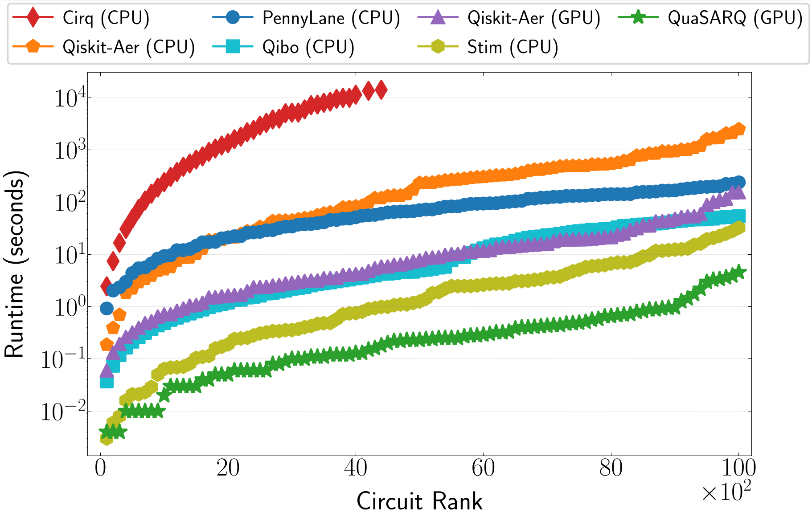
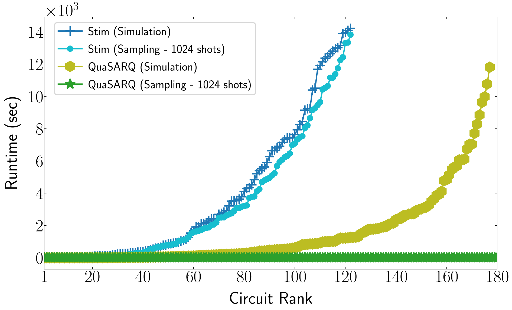
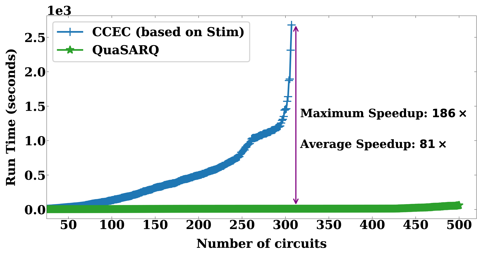
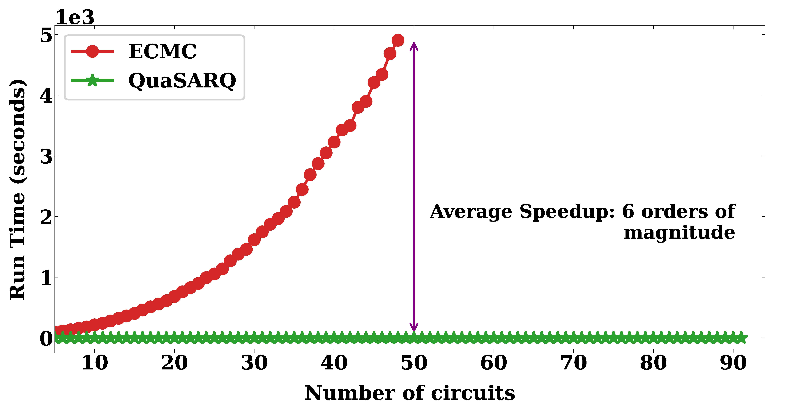

[](https://www.gnu.org/licenses/gpl-3.0)
[](https://github.com/muhos/QuaSARQ/actions/workflows/test-build.yml)
# QuaSARQ
QuaSARQ stands for Quantum Simulation and Automated Reasoning. 
It is a parallel simulator of quantum stabilizer circuits capable of harnessing NVIDIA CUDA-enabled GPUs to accelerate the simulation of stabilizer gates. 

---

## Requirements
- CUDA-capable GPU with a pre-installed NVIDIA driver
- [CUDA Toolkit](https://docs.nvidia.com/cuda/) v12 or later
- [cuarena](https://github.com/muhos/cuarena)  GPU memory allocator library
- CMake 3.18 or later (to build cuarena)
- GCC/G++ with C++20 support

---

## Build

### 1. Install CUDA
For Ubuntu 24.04:<br>

`wget https://developer.download.nvidia.com/compute/cuda/repos/ubuntu2404/x86_64/cuda-keyring_1.1-1_all.deb`<br>
`sudo dpkg -i cuda-keyring_1.1-1_all.deb`<br>
`sudo apt-get update`<br>
`sudo apt-get -y install cuda-toolkit-12-8`<br>

The source code is also platform-compatible with Windows and WSL2. To install CUDA on those platforms, follow the
installation guide in https://docs.nvidia.com/cuda/.

### 2. Install QuaSARQ

- Clone the cuarena library before building QuaSARQ:

```
git clone https://github.com/muhos/cuarena.git /path/to/cuarena
```

- Build the simulator by pointing it at the cuarena directory:

```
cd src && make CUARENA_DIR=/path/to/cuarena && make install
```

Make will build cuarena first then the `quasarq` binary and the library `libquasarq.a` will be created by default in the `build` directory.<br>

### Debug and Testing
Add `assert=1` argument with the make command to enable assertions or `debug=1` to collect debugging information.<br>

```
make CUARENA_DIR=/path/to/cuarena assert=1
```

---

## Usage
The simulator can be used via the command `quasarq [<circuit>.<stim>/<qasm>][<option> ...]`.<br>
For more options, type `quasarq -h` or `quasarq --helpmore`.

---

## Simulation Benchmarking
QuaSARQ implements two GPU-accelerated simulation modes:
- **Single-shot simulation**: applies parallel Gaussian elimination via a three-pass prefix-XOR formulation to handle projective measurements, eliminating sequential dependencies present in CPU-based approaches like Stim.
- **Many-shot sampling**: uses GPU-based Pauli frames to amortize tableau collapse costs across thousands of shots in parallel without repeated Gaussian elimination.

Benchmarks were run on an RTX 4090 (24 GB) against Stim, Qiskit-Aer (CPU/GPU), Qibo, Cirq, and PennyLane, across two suites:
- **Light suite**: 100–10,000 qubits, depths ∈ {100, 500, 1000}
- **Heavy suite**: 1,000–180,000 qubits, depths ∈ {100, 500, 1000} (~130M gates at peak)

QuaSARQ completes **177 circuits within 72 hours** on the heavy suite, vs. Stim's 125 circuits in 132 hours, with up to **105× speedup** on tableau evolution and **over 80% energy reduction** on demanding instances. For 1,024-shot sampling, QuaSARQ's Pauli-frame sampler shows flat runtime across circuit sizes while Stim's cost scales steeply.

Check our paper on [arXiv](https://arxiv.org/abs/2603.14641) for full algorithmic details.

<table>
  <tr>
    <td></td>
    <td></td>
  </tr>
</table>

---

## Equivalence Checking
QuaSARQ supports equivalence checking of two stabilizer circuits. For example, `quasarq C1.stim C2.stim` checks if `C1 == C2`. 
The outcome will be `EQUIVALENT` or otherwise `NOT EQUIVALENT`, indicating the failing initial state.
Check our paper in [TACAS'25](https://doi.org/10.1007/978-3-031-90660-2_6) for more insights.
The following plots compares the performance of QuaSARQ against CCEC (a Stim-based checker) and Quokka-Sharp (universal circuit simulator based on model counting).
Circuits have qubits in range of 1,000 to 500,000 qubits.

<table>
  <tr>
    <td></td>
    <td></td>
  </tr>
</table>
<br>
