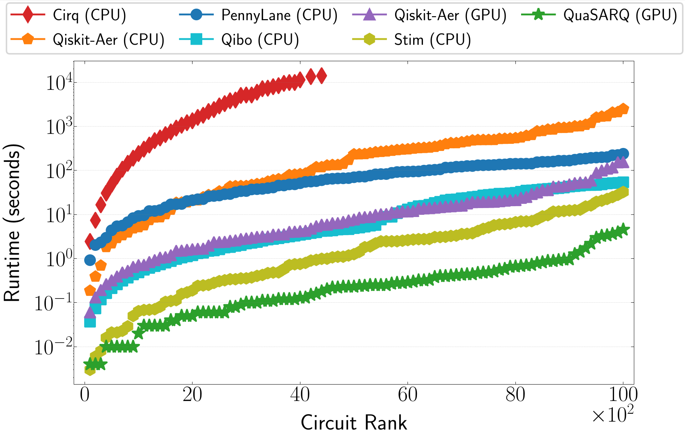
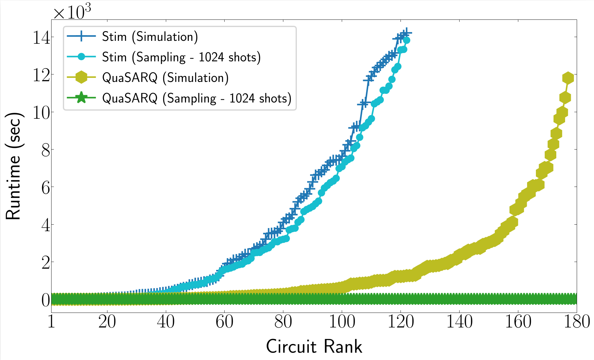

[](https://www.gnu.org/licenses/gpl-3.0)
[](https://github.com/muhos/QuaSARQ/actions/workflows/test-build.yml)
[](https://pypi.org/project/quasarq/)
[](https://pypi.org/project/quasarq/)


[](https://arxiv.org/abs/2603.14641)
[](https://doi.org/10.1007/978-3-031-90660-2_6)

# QuaSARQ

QuaSARQ stands for Quantum Simulation and Automated Reasoning. It is a CUDA-accelerated toolkit
for large stabilizer circuits, covering single-shot simulation, many-shot sampling, and
equivalence checking.

It is built for circuits where CPU stabilizer simulators become bottlenecked by tableau updates,
measurement handling, or repeated sampling. The core stabilizer operations run on NVIDIA GPUs,
and the toolkit includes a deterministic equivalence checker for stabilizer circuits.

Circuits are written in Stim format. There is a Python package, and a command-line tool that adds
random circuit generation and a set of internal checkers.

## Install

```bash
pip install quasarq
```

The wheels carry their own CUDA runtime and device code, so they need no toolkit, no cuArena and
no compiler:

| | requirement |
| --- | --- |
| OS | Linux x86-64, glibc 2.28 or newer (RHEL 8, Ubuntu 20.04, Debian 11, …) |
| Python | CPython 3.10 through 3.13 |
| GPU | Pascal (sm_60) or newer, up to Blackwell |
| driver | 525 or newer |

To build the command-line tool instead, see [docs/cli.md](docs/cli.md).

## Python

```python
import quasarq, stim

circuit = stim.Circuit.generated("surface_code:rotated_memory_z", distance=5, rounds=5,
                                 after_clifford_depolarization=0.001)

dets, obs = quasarq.compile_detector_sampler(circuit, seed=1).sample(100_000, separate_observables=True)

measurements = quasarq.compile_sampler(circuit, seed=1).sample(100_000)
```

A `stim.Circuit` or circuit text goes directly in, and detection events or raw measurements return as numpy arrays. `quasarq.sinter` plugs the GPU sampler into a `sinter.collect` run, where
pymatching does the decoding:

```python
import sinter
from quasarq import sinter as quasarq_sinter

if __name__ == "__main__":          # required, since sinter starts worker processes
    stats = sinter.collect(
        num_workers=4,
        tasks=[sinter.Task(circuit=circuit, json_metadata={"d": 5})],
        max_shots=1_000_000,
        max_errors=1000,
        decoders=["quasarq"],
        custom_decoders={"quasarq": quasarq_sinter.QuaSARQSampler(seed=1)},
    )
```

Two more entry points do not involve sampling: `quasarq.simulate(circuit)` runs a circuit once on
the tableau path and hands back the measurements and the final state as Pauli strings, and
`quasarq.equivalent(a, b)` answers whether two circuits realise the same Clifford operation.

Runnable examples live in [examples/](examples): [run_sinter.py](examples/run_sinter.py) for a
distance sweep collected with sinter, [run_simulation.py](examples/run_simulation.py), and
[run_equivalence.py](examples/run_equivalence.py). The full Python API is documented in
[src/binding/README.md](src/binding/README.md).

## What it does

| Mode | Python | Command line |
| --- | --- | --- |
| Single-shot simulation of a large tableau | `simulate(circuit)` | `quasarq circuit.stim` |
| Many-shot sampling with Pauli frames | `compile_sampler`, `compile_detector_sampler` | `quasarq circuit.stim --shots=n` |
| Equivalence checking of two circuits | `equivalent(a, b)` | `quasarq a.stim b.stim` |
| Random Clifford circuit generation | &ndash; | `quasarq --qubits=n --depth=d` |

All of them share the same core: Clifford gates are applied directly to a GPU-resident tableau,
and projective measurements use parallel pivot search with prefix-XOR updates, avoiding the
sequential bottleneck that often dominates large tableaux. Sampling amortizes the cost of tableau
collapse across shots by propagating Pauli frames on the GPU.

Internal checkers for the scheduler, tableau, measurement records, detectors, and observables can
be switched on from the command line; see [docs/cli.md](docs/cli.md).

## Supported instructions (Same as Stim)

| Group | Instructions |
| --- | --- |
| Single-qubit Cliffords | `I`, `X`, `Y`, `Z`, `H`, `S`, `S_DAG`, `SQRT_X`, `SQRT_X_DAG`, `SQRT_Y`, `SQRT_Y_DAG` |
| Two-qubit Cliffords | `CX`, `CY`, `CZ`, `SWAP`, `ISWAP`, `ISWAP_DAG` |
| Measurement and reset | `M`, `MX`, `MY`, `MR`, `MRX`, `MRY`, `R`, `RX`, `RY` |
| Noise channels | `X_ERROR`, `Y_ERROR`, `Z_ERROR`, `DEPOLARIZE1`, `DEPOLARIZE2`, `PAULI_CHANNEL_1`, `PAULI_CHANNEL_2` |
| Annotations | `DETECTOR`, `OBSERVABLE_INCLUDE`, `TICK` |
| Blocks | `REPEAT n { … }` |

Measurement instructions take a flip probability, as in `M(0.001) 0 1 2`. Aliases are accepted:
`CNOT`, `ZCX`, `ZCY`, `ZCZ`, `H_XZ`, `SQRT_Z`, `SQRT_Z_DAG`, `MZ`, `MRZ`, `RZ`. A further set is
decomposed into the gates above while parsing: `H_XY`, `H_YZ`, `C_XYZ`, `C_ZYX`, `XCX`, `XCY`,
`XCZ`, `YCX`, `YCY`, `YCZ`, `SQRT_XX`, `SQRT_YY`, `SQRT_ZZ` with their daggers, `CXSWAP`,
`SWAPCX`, `CZSWAP`, and `SWAPCZ`.

Anything outside this set, such as `MPP`, `SPP`, `MXX`/`MYY`/`MZZ`, `CORRELATED_ERROR` or the
heralded channels, is skipped silently rather than rejected, so check that your circuit only uses
the instructions above.

`TICK` acts as a scheduling barrier by default, which preserves the layers an input circuit
already has. `-ignore-ticks` lets the scheduler compact independent gates across `TICK`
boundaries instead, giving denser windows. `QUBIT_COORDS` and `SHIFT_COORDS` are parsed and
ignored; detector and observable declarations drive the measurement-record checks and the
detection-event output.

## GPU memory

The pool is sized automatically per run from the circuit and the shot count, so one run does not lock the whole
device against other processes. Cap it explicitly when several jobs share a card, which is worth
doing under sinter, where decoding costs about twice what sampling does and only separate
processes decode in parallel:

```python
quasarq.set_max_device_memory(2048)   # MB; "auto" sizes it from the circuit, 0 takes what is free
```

```bash
./build/quasarq circuit.stim --shots=100000 --max-gpu-memory=2048
```

Results never depend on the cap: a smaller pool only changes how many shots are simulated per chunk.

## Command line

Built from source, `build/quasarq` is the executable and `build/libquasarq.a` the static library.
It needs the CUDA Toolkit, a C++20 compiler, CMake, and
[cuArena](https://github.com/muhos/cuArena):

```bash
git clone https://github.com/muhos/cuArena.git /path/to/cuArena
make CUARENA_DIR=/path/to/cuArena
```

```bash
./build/quasarq examples/deterministic_measurement.stim --shots=1024 --seed=1
./build/quasarq examples/equiv_a.stim examples/equiv_b.stim
./build/quasarq --qubits=1000 --depth=500
```

[docs/cli.md](docs/cli.md) has the build details, every option, the diagnostics, and one section per mode.

## Benchmark results

In the stabilizer simulation benchmarks reported in the paper, QuaSARQ was evaluated against
Stim, Qiskit-Aer, Qibo, Cirq, and PennyLane on light and heavy benchmark suites. The heavy suite
reaches 180,000 qubits and depth 1,000, roughly 130M gates at peak. QuaSARQ completes 177
heavy-suite circuits within 72 hours, compared with 125 circuits in 132 hours for Stim, with up
to 105x speedup on tableau evolution and over 80% energy reduction on demanding instances.






For equivalence checking, QuaSARQ was evaluated against CCEC and Quokka-Sharp on stabilizer
circuits ranging from thousands to hundreds of thousands of qubits, with an average speedup of
81x over CCEC and a 98% lower energy draw. The papers below have the full benchmarks and the energy
measurements.

## Citation

If you use QuaSARQ, please cite the relevant papers:

```bibtex
@misc{osama2026gpuacceleratedstabilizer,
  title         = {GPU-Accelerated Quantum Simulation of Stabilizer Circuits},
  author        = {Osama, Muhammad and Thanos, Dimitrios and Laarman, Alfons},
  year          = {2026},
  eprint        = {2603.14641},
  archivePrefix = {arXiv},
  primaryClass  = {quant-ph},
  doi           = {10.48550/arXiv.2603.14641},
  url           = {https://arxiv.org/abs/2603.14641}
}

@inproceedings{osama2025parallelstabilizerequivalence,
  title     = {Parallel Equivalence Checking of Stabilizer Quantum Circuits on GPUs},
  author    = {Osama, Muhammad and Thanos, Dimitrios and Laarman, Alfons},
  booktitle = {Tools and Algorithms for the Construction and Analysis of Systems},
  series    = {Lecture Notes in Computer Science},
  volume    = {15698},
  pages     = {109--128},
  year      = {2025},
  publisher = {Springer Nature Switzerland},
  doi       = {10.1007/978-3-031-90660-2_6},
  url       = {https://doi.org/10.1007/978-3-031-90660-2_6}
}
```

## License

QuaSARQ is distributed under the GNU General Public License v3.0. See [LICENSE](LICENSE).
